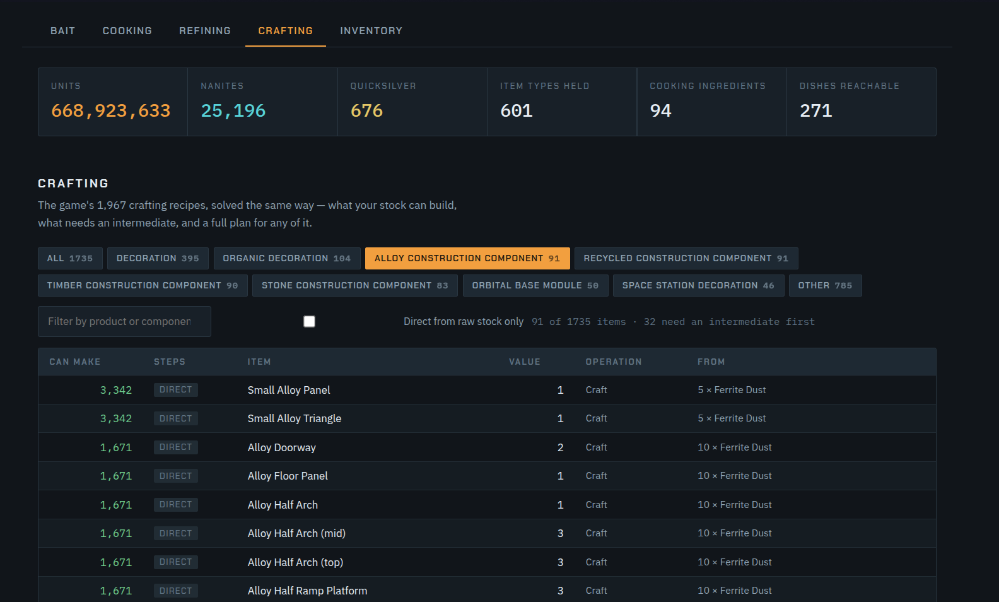
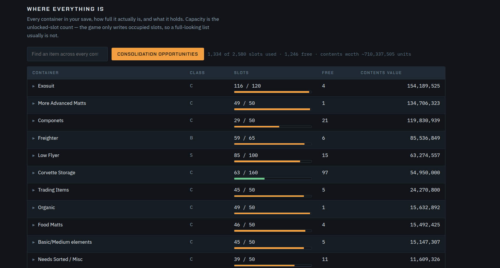
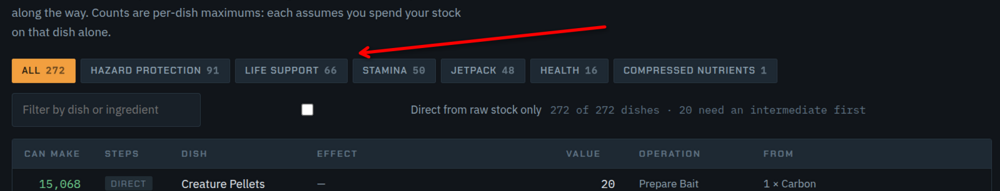

# NMS Item Manifest

Reads a No Man's Sky save and shows what you can actually make with what you
are actually carrying — cooking, refining, crafting, fishing bait — plus a full
map of where every item is stored across every container.

Read-only. Your save is opened, decoded in memory, and never written to.
Nothing is uploaded: the page runs on your own machine.

## Run it

**The easy way — no Python needed.** Download the file for your machine from
[Releases](https://github.com/Gelmage/nms-item-manifest/releases) and
double-click it:

| You have | Download |
|---|---|
| Windows | `NMS-Item-Manifest-windows.exe` |
| Mac with Apple Silicon (M1/M2/M3/M4) | `NMS-Item-Manifest-macos-apple-silicon` |
| Mac with Intel | `NMS-Item-Manifest-macos-intel` |

Both will warn that the program is unsigned, because it is. On Windows choose
*More info* then *Run anyway*. On macOS right-click the file and choose *Open*,
then *Open* again — only needed the first time. If macOS refuses outright:

    chmod +x ~/Downloads/NMS-Item-Manifest-macos-*
    xattr -d com.apple.quarantine ~/Downloads/NMS-Item-Manifest-macos-*

Not sure which Mac you have? Apple menu → About This Mac. *Apple M1* or similar
means Apple Silicon.

**From source**, if you have Python — clone the repo and use the wrapper for
your platform: `NMS Item Manifest (Windows).bat`,
`NMS Item Manifest (Mac).command`, or `./item-manifest.sh`. They install the
one dependency (`lz4`) for you. Note that macOS 12.3 and later ship no Python
at all, so the downloaded build is usually the easier route there.

It finds your save automatically, opens a page in your browser, and reads the
save again whenever you press **Refresh**.

By hand:

    pip install lz4
    python3 manifest.py              open the page
    python3 manifest.py --print      one reading to stdout, no browser
    python3 manifest.py --port 9000  serve somewhere else

## What it shows

**Bait** — all six fishing lures, what you already hold and where, what you can
make now, and what you could make after crafting the missing parts.

**Cooking** — every dish your stock can reach, including ones that need an
intermediate cooked first. Effects and sale values come from the game's own
reward tables. Click any dish for a build plan.

**Refining** — the same reach calculation across the game's 361 refiner recipes.

**Crafting** — the 1,967 items that carry a recipe, solved the same way.

**Trade** — every trade commodity you are carrying, grouped by the category the
game shows in its description, with the economy to sell each group in. The
category and value come from the game's own tables; the economy pairing is the
community-documented trade loop, recorded because the game never states it. Both
loops close over all seven categories, which is the main reason to trust it.
Every economy appears in game under any of four names, so hovering one shows
all of them - a system labelled "Commercial" is the Trading economy.

**Inventory** — every container with its real capacity, what it holds, what it
is worth, an item locator that answers "where is my Chromatic Metal", and a
consolidation view showing stacks you could merge and how many slots that frees.

Capacity is the unlocked-slot count, not the number of occupied slots: the game
only writes slots that hold something, so a chest listing 50 items and a suit
listing 50 items look identical in the file until you read the slot list.

**Cooking**, with effects and values straight from the game's reward tables:

Build plans spend what you already hold before crafting anything, and list the
operations in the order you would actually do them.

## Where saves are found

Steam on Windows, macOS, Linux and Steam Deck, including Proton prefixes and
games installed on secondary drives (`libraryfolders.vdf` is read). If your save
is somewhere unusual, press **Load a save** on the page and pick `save.hg`
yourself — that path works everywhere and needs no server at all.

The tool reads whichever context the game is actually playing: a save holds both
a normal and an expedition context, and reading the wrong one silently reports
the other save's numbers.

## Building the page

`index.html` is generated. Edit `page.template.html`, then:

    python3 build.py          ship-ready page, contains no save data
    python3 build.py --bake   bakes your current save in, for local use only

**The committed `index.html` contains no save data.** If you run `--bake`, run
`build.py` again before committing.

## Where the game data comes from

Item names, recipes and effects are datamined v7.00 tables from
[bradhave94/nms-data-extractor](https://github.com/bradhave94/nms-data-extractor)
(MIT). The game's own copies live in `HGPAK` archives, which are not PSARC and
would need separate reverse engineering.

**The tables are committed, not downloaded at runtime.** That is deliberate: the
tool then works offline, and cannot be broken by an upstream repository moving
or disappearing. A given commit always behaves the same way.

The cost is that a game patch can make a recipe stale, so refreshing is a
deliberate act:

    python3 refresh_tables.py --check    report what would change
    python3 refresh_tables.py            refresh the tables
    python3 build.py                     rebuild the page

`--check` warns if items have vanished upstream, which is the signal that
something went wrong rather than that the game changed.

Container names come from the MBINCompiler key mapping: the game's stack-size
group is not a name — it reports "Chest" for all ten storage containers.

## Known limits

- Tables are v7.00. A later patch could change a recipe.
- Recipe counts are per-item maximums: each assumes you spend your stock on that
  one item. Read them as a menu, not a sum.
- Procedural curiosities show as `FAMILY · SEED (procedural)` rather than a
  name. Their names are generated from the seed at runtime and are not stored
  in the save; the community tables that hold them run to roughly 247 MB across
  21 families, against a 727 KB tool. They are at least kept distinct from one
  another, which matters because two items in the same family are different
  objects, not duplicates.
- Procedural technology upgrades do resolve, because the base id names them and
  the seed only sets the roll.
- It answers "can I reach this", not "what is the best use of my stock". It is
  not a scheduler.

## Credits

The LZ4 save reader comes from [nms-core-run](https://github.com/Gelmage/nms-core-run).
